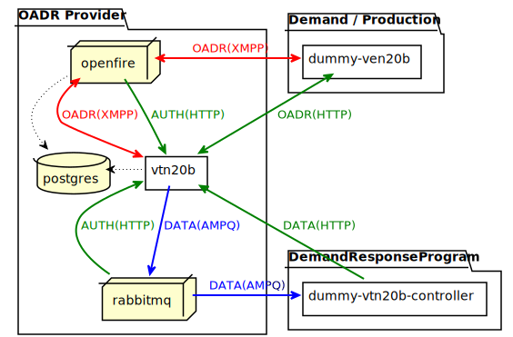
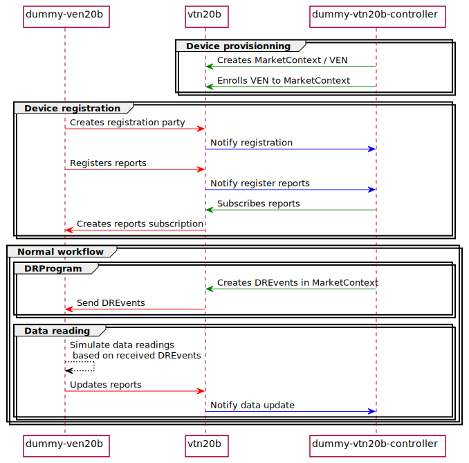

# OpenADR  [](https://travis-ci.org/avob/OpenADR)  [](https://codecov.io/gh/avob/OpenADR)


OpenADR protocol java implementation: *https://www.openadr.org/*

Provides a standalone VTN 2.0b implementation and APIs to implements demand-response program and device management.
Provides a VEN 2.0b library which can be used to implements a VEN 2.0b.


Module | Description
------------- | ------------- 
OpenADRSecurity | OADR security framework (PKI RSA/ECC, XmlSignature)
OpenADRModel20b | OADR 2.0b model java classes generated from XSDL definition file
OpenADRServerVEN20b | OADR 2.0b VEN library
OpenADRServerVTN20b | OADR 2.0b VTN implementation + Control API / UI
DummyVEN20b | Dummy OADR 2.0b VEN implementation based on OpenADRServerVEN20b
DummyVTN20bController | Dummy OADR 2.0b VTN controller implementation acting DRProgram and device manager. Leverage OpenADRServerVTN20b APIs.


## Certificates

Tests certificates are required to test project or run demo:
```shell
	./generate_test_cert.sh
```

This command will create several VTN / VEN / User / App certificates upon a self-signed generated authority. This authority has to be installed to disable insecure https warning when using VTN Control API / UI in a browser. VTN certificate uses the following Common Name, which need to be added to the local DNS configuration.

- Install self-signed vtn certificate in your browser: cert/vtn.oadr.com-rsa.crt
- Add "127.0.0.1 vtn.oadr.com" to your local "/etc/hosts"

 An admin trusted client certificate is also generated and can be installed to to perform client authentication.

- Install x509 admin certificate in your browser: cert/admin.oadr.com.crt (optional, authentication can be performed using login/pass: admin/admin)

## Oadr demo

Run a demo of a full 2.0b OADR stack infrastructure interacting with a dummy VEN and a dummy VTN controller. OpenADR communications between VEN and VTN are transported by XMPP. VEN authentication use x509 client certificates and payloads are secured with XML signatures.

The VTN controller is acting as both a device manager by creating VEN authorization / subscribing to VEN reports, and a DemandResponseProgram manager by creating DREvents. The dummy VEN implementation will simulate data reading using information gathered in DREvents and continuously push them to the VTN. 

The VTN controller is notified by VTN using AMQP when VTN receive payload from VEN (createRegistrationParty, registerReport, updateReports).

### Requirement

- Generate certificates
- Docker 19.03.13

### Run

```shell
	docker-compose up --build
```

### Endpoints

- VTN Control Swagger UI: https://vtn.oadr.com:8181/testvtn/swagger-ui.html
- VTN Control UI: https://vtn.oadr.com:8181/testvtn/
- VTN RabbitMQ Management UI: http://localhost:15672
- VTN Openfire Management UI: http://localhost:9090
- Nodered Terminal: http://localhost:1880 
- Ven1 Nodered Dashboard: http://localhost:1880/ui/#!/0

### Components diagram

<details>
	<summary>PlantUML components diagram</summary>
	```
	@startuml demo_component_diagram

	package "Demand / Production" {
	    rectangle "dummy-ven20b" as dummyVen #FFF
	}

	package "OADR Provider" {
	    rectangle "vtn20b" as vtn #FFF
	    database postgres
	    node rabbitmq
	    node openfire
	}

	package "DemandResponseProgram" {
	    rectangle "dummy-vtn20b-controller" as dummyVtnController #FFF
	}


	vtn <-up-> openfire #line:red;line.bold;text:red  : OADR(XMPP)
	openfire -> vtn #green;line.bold;text:green : AUTH(HTTP)
	vtn -down-> rabbitmq #blue;line.bold;text:blue   : DATA(AMQP)
	dummyVen <--> vtn #green;line.bold;text:green : OADR(HTTP)
	dummyVen <-> openfire #line:red;line.bold;text:red  : OADR(XMPP)
	openfire -> postgres #black;line.dotted;text:black
	vtn -> postgres #black;line.dotted;text:black
	rabbitmq -down-> vtn #green;line.bold;text:green : AUTH(HTTP)
	dummyVtnController -up-> vtn #green;line.bold;text:green : DATA(HTTP)
	dummyVtnController <-- rabbitmq #blue;line.bold;text:blue   : DATA(AMQP)

	@enduml
	```

</details>



### Sequence diagram

<details>
	<summary>PlantUML sequence diagram</summary>
	```
	@startuml demo_sequence_diagram

	participant "dummy-ven20b" as dummyVen #FFF
	participant "vtn20b" as vtn #FFF
	participant "dummy-vtn20b-controller" as dummyVtnController #FFF

	group Device provisionning
	dummyVtnController -[#green]> vtn: Creates MarketContext / VEN
	dummyVtnController -[#green]> vtn: Enrolls VEN to MarketContext
	end 

	group Device registration
	dummyVen -[#red]> vtn: Creates registration party
	vtn -[#blue]> dummyVtnController: Notify registration


	dummyVen -[#red]> vtn: Registers reports
	vtn -[#blue]> dummyVtnController: Notify register reports
	dummyVtnController-[#green]> vtn: Subscribes reports
	vtn -[#red]> dummyVen: Creates reports subscription
	end

	group Normal workflow
	group DRProgram
	dummyVtnController -[#green]> vtn: Creates DREvents in MarketContext
	dummyVen <[#red]- vtn: Send DREvents
	end
	group Data reading
	dummyVen -[#black]-> dummyVen: Simulate data readings\n based on received DREvents
	dummyVen -[#red]> vtn: Updates reports
	vtn -[#blue]> dummyVtnController: Notify data update
	end

	end

	@enduml
	```
</details>




## Test / build project

### Requirements
- Backend build dependencies: Java 11 / Maven 3
- Frontend build dependencies: NodeJS 8.15.0 / NPM 6.4.1

### Test

```shell
	mvn clean verify
```

### Compile for external use (AMQP broker and DB middleware must be provided)

```shell
	mvn clean package -P external,frontend 
```

### Compile for standalone use (in-memory AMQP broker and DB)

```shell
	mvn clean package
```

## Links

- [OpenADR 2.0b Spec](https://cimug.ucaiug.org/Projects/CIM-OpenADR/Shared%20Documents/Source%20Documents/OpenADR%20Alliance/OpenADR_2_0b_Profile_Specification_v1.0.pdf)
- [DRProgram Guide v1.0](https://www.openadr.org/assets/openadr_drprogramguide_v1.0.pdf)

